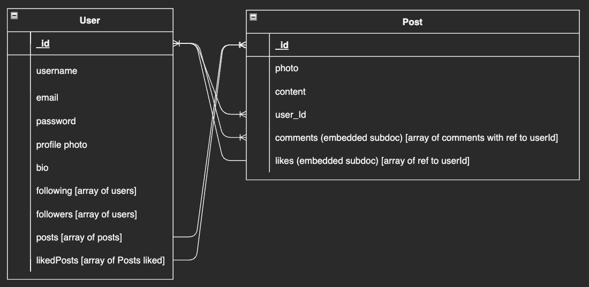
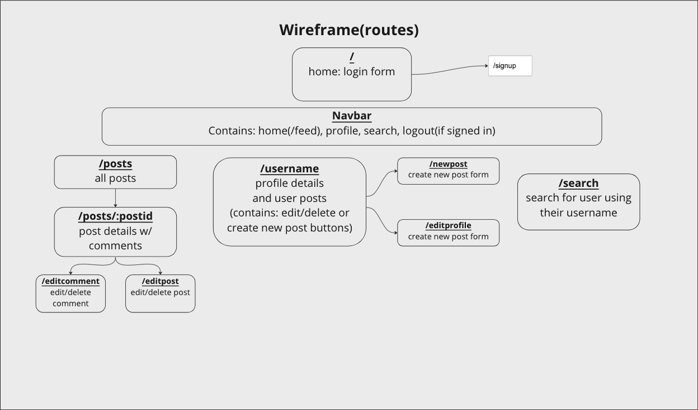
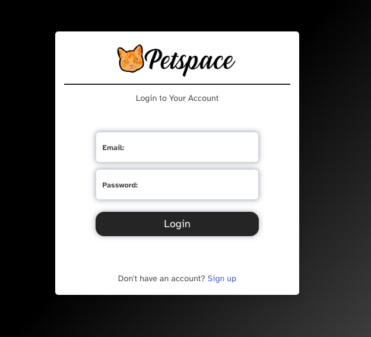
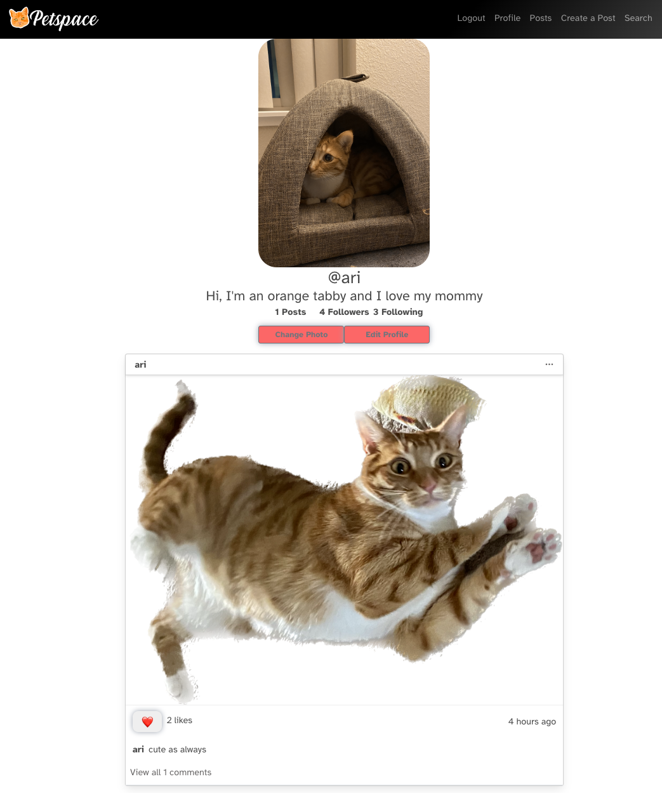

# PetSpace

## Project idea and description
MyPetSpace is an online photo-sharing social media application specifically for pets!
Our application aims to create a platform that allows users to share and connect their furry friends to the rest of the world. Users can upload photos to our application and share them with their followers or with a select group of friends.
Users can also view, comment and like posts created by their friends.


## App Link
https://beautiful-otter-058b32.netlify.app

## Tech Used
- CSS/Bootstrap
- JavaScript
- Node
- Express
- Axios
- REACT
- MongoDB
- Mongoose
- bcrypto
- jwt

## Installation Instruction

* Fork and clone this repository to your local directory
* Navigate to the directory in your terminal and run ` npm i ` to install dependencies
* Run `touch .env.local `in the terminal and type in the following code in the .env file: <br/>
```REACT_APP_SERVER_URL=http://localhost:8000``` <br/>
* Go to the <a href="https://github.com/mousesaver/petspace-p3-server" target="_blank">server repository</a> and folow the installation instruction
* Once finished, use `npx nodemon` (or just `nodemon` if you installed it globally) in the server terminal and `npm start` in the client terminal to start your application
## ERDs


## Restful Routing Chart
### User Routes
| Method | Path | Purpose |
| ------ | -------------- | -------------------------------- |
| GET | `/` | home page that ask user to login/signup|
| GET | `/register/` | user signup page |
| POST | `/login/` | accept a payload of form data and use it log a user in, then redirects back to `GET /:username/` |
| POST | `/register/` | creates a new user, then redirects to `GET /:username/` |
| GET | `/:username/` | user profile page |
| GET | `/:username/edit/` | user profile edit page |
| PUT | `/:username/edit/` | update user's profile, then redirect to `GET /:username/`|
| PUT | `/:username/` | update user's following and followers|
| PUT | `/:username/photo/` | update user's profile photo|
| DELETE | `/:username/` | delete user profile page, then redirect to `GET /` |
| GET | `/search/` | user search page |

### Post Routes
| Method | Path | Purpose |
| ------ | -------------- | -------------------------------- |
| GET | `/posts/` | show your and your friends' posts in a reverse chronological order|
| POST | `/posts/` | creates a new post, then redirects to `GET /posts/` |
| GET | `/posts/:postid/` | show a specific post|
| PUT | `/posts/:postid/` | update a post, then redirect to `GET /posts/:postid/`|
| DELETE | `/postscode/:postid/` | delete a post, then redirect to `GET /posts/` |
| POST | `/posts/:postid/like/` | add a like to a specific post|
| PUT | `/posts/:postid/like/` | remove a like to a specific post|

### Comment Routes
| Method | Path | Purpose |
| ------ | -------------- | -------------------------------- |
| POST | `/posts/:postid/comments/` | add a comment to a specific post|
| GET | `/posts/:postid/comments/:commentid/` | get a comment for the editComment page|
| PUT | `/posts/:postid/comment/:commentid/` | edit a comment to a specific post, then redirects to `GET /posts/:postid/`|
| DELETE | `/posts/:postid/comment/:commentid/` | delete a specific comment|

## Initial Wireframe

## Final App


## User Stories
- As a user, I want to create an account for my pet.
- As a user, I want to edit/delete an account for my pet.
- As a user, I want to create/edit/delete posts on my pet's account.
- As a user, I want to read my following pets' posts in one page.
- As a user, I want to search for other pets.
- As a user, I want to follow/unfollow my friends.
- As a user, I want to like/unlike a post.
- As a user, I want to comment on a post.
- As a user, I want to edit/delete my comment.
- As a non-user, I will be able to create an account.

## MVP Goals
- Render main posts for users ✅
- Render users' personal profiles with their posts ✅
- Direct users to a sign up/login page if they haven't signed in ✅
- Allow user to create/edit/delete their account ✅
- Allow user to create/edit/delete their post(s) ✅
- Allow user to create/edit/delete their comment(s) ✅
- Allow user to like/unlike a post ✅
- Allow user to search for other users and follow/unfollow them ✅

## Stretch Goals
- allow user to upload a profile pic ✅
- Render a page of random posts
- give user ability to turn profile to private
- allow user to dm another user

## Approach and Roadblocks
Once we received our groups, we discussed ideas for our app. Eventually, we settled on PetSpace, a social media platform for your furry friends. When designing the site, we took inspiration from other social media sites and how we could implement ideas from their site into our app. Our group took the work into two categories: server and client. We tackled the issues of our project from both sides simultaneously.

During the development phase of our project, we began by stubbing out a rough draft of our routes to ensure that we could connect to each page and have basic functionality. After having the initial site planned out, we re-evaluated the initial routes on the backend to more accurately fit our needs now that we had the site in front of us and had a better grasp on what we needed.

After we passed the initial development phase, we moved on to debugging. Debugging is where our team spent most of our time. We decided the best approach was to tackle one page at a time, assigning everyone a page to work on Trello. We did this to ensure minimal merge conflicts. We communicated with the front and back end to solve our bugs.

Major roadblocks:
- Setting up backend to update data accordingly based on user interaction as we had 2 models with embedded subdocs and multiple references to models
- Attaching our local database with Cloudinary proved challenging as we needed to connect the user to every post they created with the cloud.
- Styling: our team wanted to ensure the functionality of our site functioned the way we intended before we began work on the styling of the page; this left us with only 1 ½ days before our project to do the styling for our site.

## Project Creators
This project was developed by <a href="https://github.com/AdrianRRojo" target="_blank">Adrian</a>, <a href="https://github.com/OmgValicious" target="_blank">Val</a>, <a href="https://github.com/valerieyang00" target="_blank">Valerie</a>, and <a href="https://github.com/mousesaver" target="_blank">Sean</a> with equal contribution.
